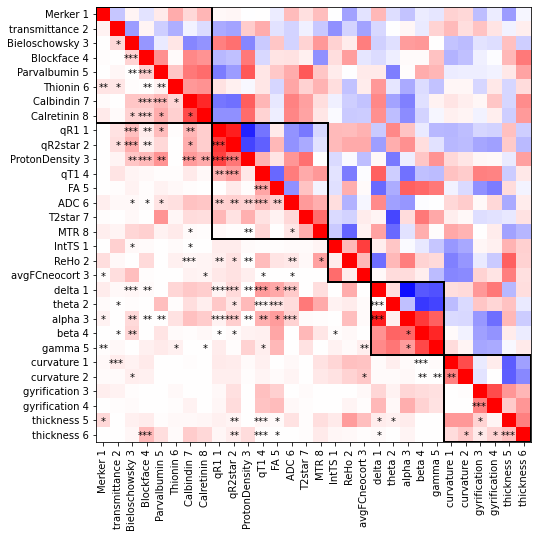
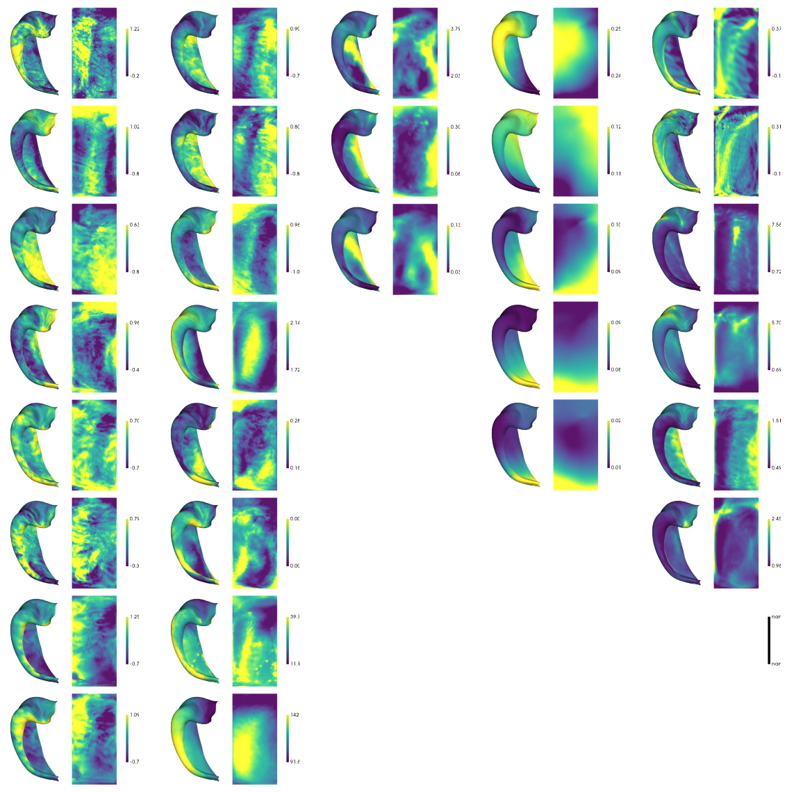
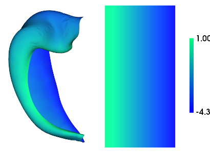
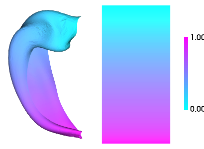
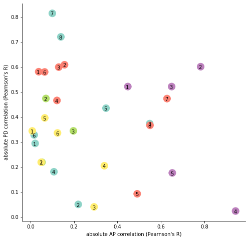
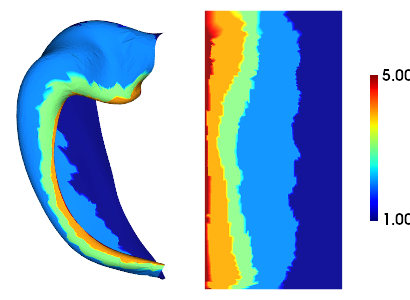
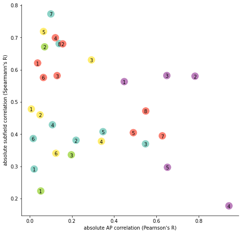
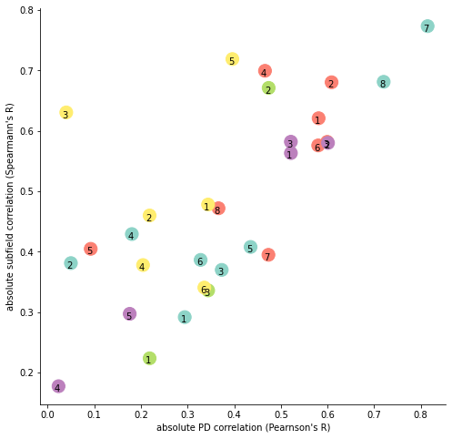
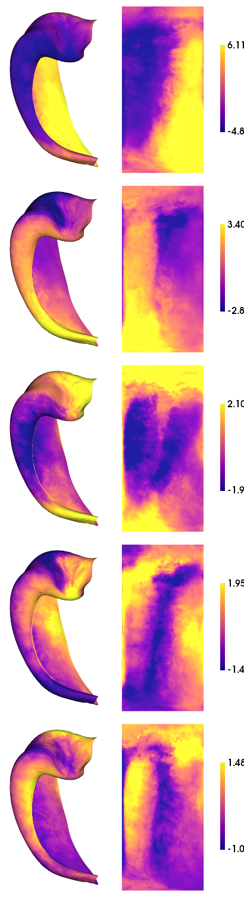
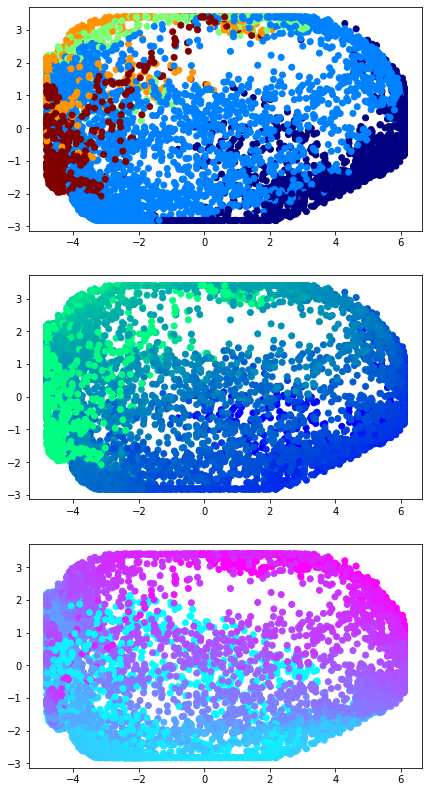

.. code:: ipython3

    import numpy as np
    from numpy.matlib import repmat
    import matplotlib.pyplot as plt
    from matplotlib.patches import Rectangle
    import nibabel as nib
    import scipy
    from scipy.stats import spearmanr
    from itertools import product
    import sys
    sys.path.insert(1, '/export03/data/opt/hippunfold_toolbox/hippunfold_toolbox')
    import plotting
    import utils
    import copy
    import glob
    sys.path.insert(1, '/export03/data/opt/Hippo_Spin_Testing')
    from hippo_spin_testing import spin_test
    from adjustText import adjust_text
    sys.path.insert(1, '/data/mica1/01_programs/micapipe-v0.2.0/functions')
    from build_mpc import build_mpc
    from brainspace.gradient import GradientMaps
    from sklearn.manifold import TSNE
    from sklearn.decomposition import PCA

.. code:: ipython3

    files = [
     '../maps/HippoMaps-initializationMaps/Dataset-BigBrain/histology-Merker_average-4_hemi-mix_den-unfoldiso_label-hipp.shape.gii',
     '../maps/HippoMaps-initializationMaps/Dataset-AxerPLI/histology-PLI-transmittance_average-1_hemi-mix_den-unfoldiso_label-hipp.shape.gii',
     '../maps/HippoMaps-initializationMaps/Dataset-AHEAD/histology-Bieloschowsky_average-4_hemi-mix_den-unfoldiso_label-hipp.shape.gii',
     '../maps/HippoMaps-initializationMaps/Dataset-AHEAD/histology-Blockface_average-4_hemi-mix_den-unfoldiso_label-hipp.shape.gii',
     '../maps/HippoMaps-initializationMaps/Dataset-AHEAD/histology-Parvalbumin_average-4_hemi-mix_den-unfoldiso_label-hipp.shape.gii',
     '../maps/HippoMaps-initializationMaps/Dataset-AHEAD/histology-Thionin_average-4_hemi-mix_den-unfoldiso_label-hipp.shape.gii',
     '../maps/HippoMaps-initializationMaps/Dataset-AHEAD/histology-Calbindin_average-4_hemi-mix_den-unfoldiso_label-hipp.shape.gii',
     '../maps/HippoMaps-initializationMaps/Dataset-AHEAD/histology-Calretinin_average-4_hemi-mix_den-unfoldiso_label-hipp.shape.gii',
        
     '../maps/HippoMaps-initializationMaps/Dataset-AHEAD/MRI-9p4T-qR1_average-4_hemi-mix_den-unfoldiso_label-hipp.shape.gii',
     '../maps/HippoMaps-initializationMaps/Dataset-AHEAD/MRI-9p4T-qR2star_average-4_hemi-mix_den-unfoldiso_label-hipp.shape.gii',
     '../maps/HippoMaps-initializationMaps/Dataset-AHEAD/MRI-9p4T-ProtonDensity_average-4_hemi-mix_den-unfoldiso_label-hipp.shape.gii',
     '../maps/HippoMaps-initializationMaps/Dataset-PNI/MRI-7T-qT1_average-20_hemi-mix_den-0p5mm_label-hipp.shape.gii',
     '../maps/HippoMaps-initializationMaps/Dataset-PNI/MRI-7T-FA_average-20_hemi-mix_den-0p5mm_label-hipp.shape.gii',
     '../maps/HippoMaps-initializationMaps/Dataset-PNI/MRI-7T-ADC_average-20_hemi-mix_den-0p5mm_label-hipp.shape.gii',
     '../maps/HippoMaps-initializationMaps/Dataset-PNI/MRI-7T-T2star_average-20_hemi-mix_den-0p5mm_label-hipp.shape.gii',
     '../maps/HippoMaps-initializationMaps/Dataset-PNI/MRI-7T-MTR_average-20_hemi-mix_den-0p5mm_label-hipp.shape.gii',
    
     '../maps/HippoMaps-initializationMaps/Dataset-MICs/MRI-3T-rsfMRI-IntTS_average-99_hemi-L_den-2mm_label-hipp.shape.gii',
     '../maps/HippoMaps-initializationMaps/Dataset-MICs/MRI-3T-rsfMRI-ReHo_average-99_hemi-L_den-2mm_label-hipp.shape.gii',
     '../maps/HippoMaps-initializationMaps/Dataset-MICs/MRI-3T-rsfMRI-avgFCneocort_average-80_hemi-L_den-2mm_label-hipp.shape.gii',
    
     '../maps/HippoMaps-initializationMaps/Dataset-MICs+Frauscher/iEEG-BandPower-delta_average-81_hemi-mix_den-2mm_label-hipp.shape.gii',
     '../maps/HippoMaps-initializationMaps/Dataset-MICs+Frauscher/iEEG-BandPower-theta_average-81_hemi-mix_den-2mm_label-hipp.shape.gii',
     '../maps/HippoMaps-initializationMaps/Dataset-MICs+Frauscher/iEEG-BandPower-alpha_average-81_hemi-mix_den-2mm_label-hipp.shape.gii',
     '../maps/HippoMaps-initializationMaps/Dataset-MICs+Frauscher/iEEG-BandPower-beta_average-81_hemi-mix_den-2mm_label-hipp.shape.gii',
     '../maps/HippoMaps-initializationMaps/Dataset-MICs+Frauscher/iEEG-BandPower-gamma_average-81_hemi-mix_den-2mm_label-hipp.shape.gii',
    
     '../maps/HippoMaps-initializationMaps/Dataset-Mixed/histology-curvature_average-7_hemi-mix_den-unfoldiso_label-hipp.shape.gii',
     '../maps/HippoMaps-initializationMaps/Dataset-PNI/MRI-7T-curvature_average-20_hemi-mix_den-0p5mm_label-hipp.shape.gii',
     '../maps/HippoMaps-initializationMaps/Dataset-Mixed/histology-gyrification_average-7_hemi-mix_den-unfoldiso_label-hipp.shape.gii',
     '../maps/HippoMaps-initializationMaps/Dataset-PNI/MRI-7T-gyrification_average-20_hemi-mix_den-0p5mm_label-hipp.shape.gii',
     '../maps/HippoMaps-initializationMaps/Dataset-Mixed/histology-thickness_average-7_hemi-mix_den-unfoldiso_label-hipp.shape.gii',
     '../maps/HippoMaps-initializationMaps/Dataset-PNI/MRI-7T-thickness_average-20_hemi-mix_den-0p5mm_label-hipp.shape.gii',
     ]

.. code:: ipython3

    # organize into sensible blocks of the same modality
    
    blocks_len = [8,8,3,5,6]
    blocks = np.concatenate(([0],np.cumsum(blocks_len)))
    colors = np.hstack((np.ones((blocks_len[0])),np.ones((blocks_len[1]))+1,np.ones((blocks_len[2]))+2,np.ones((blocks_len[3]))+3,np.ones((blocks_len[4]))+4))
    feature_n = np.array([])
    for f in blocks_len:
        feature_n = np.concatenate((n,np.arange(1,f+1)))

.. code:: ipython3

    # load all data
    features = []
    cdata = np.ones((7262,len(files)))
    for f in range(len(files)):
        features.append(files[f].split('/')[-1].split('_')[0])
        den = files[f].split('/')[-1].split('_')[3][4:]
        cdata[:,f],_,_ = utils.density_interp(den,'0p5mm',nib.load(files[f]).darrays[0].data, label='hipp')

.. code:: ipython3

    # check for significant correlation (spin test) (slow!)
    
    feat_corr_p = np.ones((len(features),len(features)))
    for i in range(len(features)):
        for j in range(i+1,len(features)):
            _,_,feat_corr_p[i,j],_ = spin_test.spin_test(cdata[:,i],cdata[:,j], 10000, space='orig')

.. code:: ipython3

    # plot correlation between features
    
    feat_corr = np.corrcoef(cdata.T)
    
    # bottom left will show Rsquared
    iloc = np.tril_indices(len(feat_corr))
    feat_corr[iloc] = feat_corr[iloc]**2
    
    # plot and label
    features_suffix = []
    for f,feat in enumerate(features):
        features_suffix.append(feat.split('-')[-1] + ' ' + str(int(feature_n[f])))
    fig, ax = plt.subplots(figsize=(8, 8))
    ax.imshow(feat_corr, vmin=-1, vmax=1, cmap='bwr')
    plt.yticks(ticks=range(len(features)),labels=features_suffix);
    plt.xticks(ticks=range(len(features)),labels=features_suffix, rotation=90);
    
    # box around same modality
    for i in range(len(blocks)-1):
        w = blocks[i+1]-blocks[i]
        rect = Rectangle((blocks[i]-.5,blocks[i]-.5),w,w, linewidth=2, edgecolor='k', facecolor='none')
        ax.add_patch(rect)
    
    # annotate significant correlations
    for i in range(len(features)):
        for j in range(i+1,len(features)):
            if feat_corr_p[i,j] < 0.001:
                plt.annotate('***', (i-.6,j+.3));
            elif feat_corr_p[i,j] < 0.01:
                plt.annotate('**', (i-.3,j+.3));
            elif feat_corr_p[i,j] < 0.05:
                plt.annotate('*', (i-.15,j+.3));

.. code:: ipython3

    # currently there is a bug where 9 plots are not allowed, but 10 are, so we add an extra empty plot
    cdata = np.concatenate((cdata,np.ones((cdata.shape[0],1))*np.nan),axis=1)
    blocks[-1] = blocks[-1]+1
    
    # plot all feature maps in the same plot
    fig, ax = plt.subplots(1,5, figsize=(20,50))
    for b in range(5):
        plotting.surfplot_canonical_foldunfold(cdata[:,blocks[b]:blocks[b+1]], color_bar=('right'), hemis=['L'], labels=['hipp'], unfoldAPrescale=True, share='row', tighten_cwindow=True, embed_nb=True, screenshot=True, filename='tmp.png')
        f = plt.imread('tmp.png')
        ax[b].imshow(f)
        ax[b].set_axis_off()
        ax[b].set_anchor("NW")
    
    cdata = cdata[:,:-1]
    !rm tmp.png

.. parsed-literal::

    cdata all NaN

.. code:: ipython3

    subfields = nib.load('/data/mica3/BIDS_PNI/derivatives/hippunfold_v1.3.0_supersession/hippunfold/sub-PNC002/surf/sub-PNC002_hemi-L_space-T1w_den-0p5mm_label-hipp_atlas-histologyReference2023_subfields.label.gii').darrays[0].data
    AP,_,_ = utils.density_interp('unfoldiso','0p5mm',repmat(np.linspace(0,1,254),126,1).flatten(), label='hipp')
    PD,_,_ = utils.density_interp('unfoldiso','0p5mm',repmat(np.linspace(0,1,126),254,1).T.flatten(), label='hipp')
    plotting.surfplot_canonical_foldunfold(PD, color_bar=('right'), hemis=['L'], labels=['hipp'], unfoldAPrescale=True, share='row', cmap='winter', tighten_cwindow=False, embed_nb=True)

.. parsed-literal::

    /export03/data/opt/venv/lib/python3.8/site-packages/brainspace/plotting/base.py:287: UserWarning: Interactive mode requires 'panel'. Setting 'interactive=False'
      warnings.warn("Interactive mode requires 'panel'. "

.. code:: ipython3

    plotting.surfplot_canonical_foldunfold(AP, color_bar=('right'), hemis=['L'], labels=['hipp'], unfoldAPrescale=True, share='row', cmap='cool', tighten_cwindow=False, embed_nb=True)

.. code:: ipython3

    axiscorr = np.abs(np.corrcoef(np.concatenate((cdata,AP.reshape(7262,1),PD.reshape(7262,1)),axis=1).T)[-2:,:-2])
    
    fig, ax = plt.subplots(figsize=(8,8))
    ax.spines[['right', 'top']].set_visible(False)
    ax.scatter(axiscorr[0],axiscorr[1],c=colors,cmap='Set3', s=200)
    plt.xlabel("absolute AP correlation (Pearnson's R)")
    plt.ylabel("absolute PD correlation (Pearnson's R)")
    
    for f,feature in enumerate(features):
        ax.annotate(str(int(feature_n[f])), (axiscorr[0,f]-.009, axiscorr[1,f]-.009))

.. code:: ipython3

    plotting.surfplot_canonical_foldunfold(subfields, color_bar=('right'), hemis=['L'], labels=['hipp'], cmap='jet', unfoldAPrescale=True, share='row', tighten_cwindow=False, embed_nb=True)

.. code:: ipython3

    list(product(np.arange(3), repeat=3))

.. parsed-literal::

    [(0, 0, 0),
     (0, 0, 1),
     (0, 0, 2),
     (0, 1, 0),
     (0, 1, 1),
     (0, 1, 2),
     (0, 2, 0),
     (0, 2, 1),
     (0, 2, 2),
     (1, 0, 0),
     (1, 0, 1),
     (1, 0, 2),
     (1, 1, 0),
     (1, 1, 1),
     (1, 1, 2),
     (1, 2, 0),
     (1, 2, 1),
     (1, 2, 2),
     (2, 0, 0),
     (2, 0, 1),
     (2, 0, 2),
     (2, 1, 0),
     (2, 1, 1),
     (2, 1, 2),
     (2, 2, 0),
     (2, 2, 1),
     (2, 2, 2)]

.. code:: ipython3

    perms = list(product([1,2,3,4,5],repeat=5))
    subfields_permuted = np.ones((len(subfields),len(perms)))*np.nan
    for p in range(len(perms)):
        newsf = np.ones((len(subfields)))*np.nan
        for s in range(5):
            newsf[subfields==s+1] = perms[p][s]
        subfields_permuted[:,p] = newsf

.. code:: ipython3

    subfieldscorr = np.abs(spearmanr(np.concatenate((cdata,subfields_permuted),axis=1))[0][len(features):,:len(features)])
    subfieldsmaxcorr = np.nanmax(subfieldscorr,axis=0)
    
    fig, ax = plt.subplots(figsize=(8,8))
    ax.spines[['right', 'top']].set_visible(False)
    ax.scatter(axiscorr[0],subfieldsmaxcorr,c=colors,cmap='Set3',s=200)
    plt.ylabel("absolute subfield correlation (Spearmann's R)")
    plt.xlabel("absolute AP correlation (Pearnson's R)")
    
    for f,feature in enumerate(features):
        ax.annotate(str(int(feature_n[f])), (axiscorr[0,f]-.008, subfieldsmaxcorr[f]-.007))

.. code:: ipython3

    fig, ax = plt.subplots(figsize=(8,8))
    ax.scatter(axiscorr[1],subfieldsmaxcorr,c=colors,cmap='Set3',s=200)
    ax.spines[['right', 'top']].set_visible(False)
    plt.ylabel("absolute subfield correlation (Spearmann's R)")
    plt.xlabel("absolute PD correlation (Pearnson's R)")
    
    for f,feature in enumerate(features):
        ax.annotate(str(int(feature_n[f])), (axiscorr[1,f]-.009, subfieldsmaxcorr[f]-.009))

.. code:: ipython3

    # gradient decomposition
    ngrads=5
    mmgm = GradientMaps(n_components=ngrads, kernel='pearson', random_state=0)
    mmgm.fit(scipy.stats.zscore(cdata), sparsity=0.1)

.. parsed-literal::

    GradientMaps(kernel='pearson', n_components=5, random_state=0)

.. code:: ipython3

    plotting.surfplot_canonical_foldunfold(mmgm.gradients_, labels=['hipp'], hemis=['L'], unfoldAPrescale=True, cmap='plasma', color_bar='right', share='row', tighten_cwindow=True, embed_nb=True)

.. code:: ipython3

    fig, ax = plt.subplots(nrows=3, ncols=1, figsize=(8, 14))
    ax[0].scatter(mmgm.gradients_[:,0], mmgm.gradients_[:,1], c=subfields, cmap='jet')
    ax[0].set_aspect('equal', 'box')
    ax[1].scatter(mmgm.gradients_[:,0], mmgm.gradients_[:,1], c=PD, cmap='winter')
    ax[1].set_aspect('equal', 'box')
    ax[2].scatter(mmgm.gradients_[:,0], mmgm.gradients_[:,1], c=AP, cmap='cool')
    ax[2].set_aspect('equal', 'box')

.. code:: ipython3

    plt.plot(mmgm.lambdas_)

.. parsed-literal::

    [<matplotlib.lines.Line2D at 0x7ff7692aab80>]

.. image:: DimReduct_files/DimReduct_18_1.png

.. code:: ipython3

    mmgm.lambdas_/np.sum(mmgm.lambdas_)

.. parsed-literal::

    array([0.43467193, 0.21114414, 0.14034947, 0.12646083, 0.08737363])

shelf
=====

.. code:: ipython3

    # save everything
    import shelve
    filename='../checkpoints/DimReduct.out'
    my_shelf = shelve.open(filename,'n') # 'n' for new
    for key in dir():
        try:
            my_shelf[key] = globals()[key]
        except:
            # __builtins__, my_shelf, and imported modules can not be shelved.
            print('ERROR shelving: {0}'.format(key))
    my_shelf.close()

.. parsed-literal::

    ERROR shelving: __builtin__
    ERROR shelving: __builtins__
    ERROR shelving: copy
    ERROR shelving: exit
    ERROR shelving: get_ipython
    ERROR shelving: glob
    ERROR shelving: my_shelf
    ERROR shelving: nib
    ERROR shelving: np
    ERROR shelving: plotting
    ERROR shelving: plt
    ERROR shelving: quit
    ERROR shelving: scipy
    ERROR shelving: shelve
    ERROR shelving: spin_test
    ERROR shelving: sys
    ERROR shelving: utils

.. code:: ipython3

    # load everything
    import shelve
    filename='../checkpoints/DimReduct.out'
    my_shelf = shelve.open(filename)
    for key in my_shelf:
        try:
            globals()[key]=my_shelf[key]
        except:
            print(my_shelf[key] + " not found")
    my_shelf.close()

