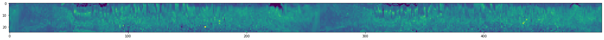
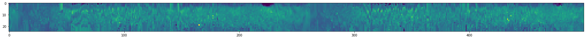
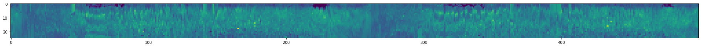
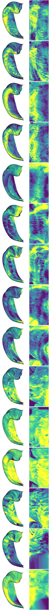
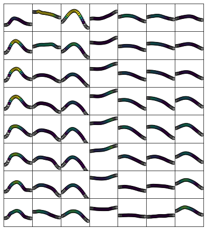
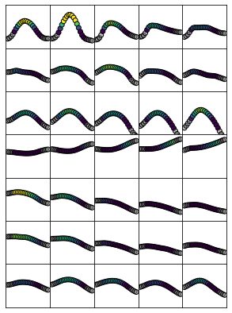
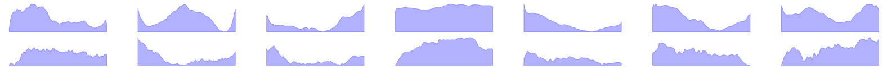
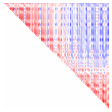
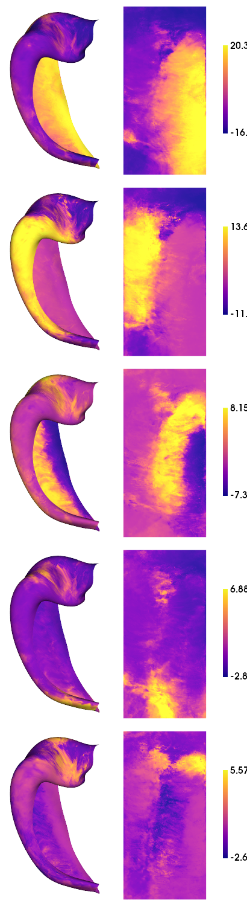
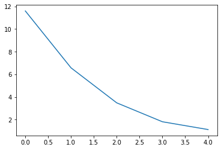

Overview
========

This notebook will examine ex-vivo histology data from the BigBrain, 3D
PLI, and AHEAD brain datasets. First wewill look at morphological
features in unfolded space

.. code:: ipython3

    import numpy as np
    import matplotlib.pyplot as plt
    import nibabel as nib
    import scipy
    import sys
    sys.path.insert(1, '/export03/data/opt/hippunfold_toolbox/hippunfold_toolbox')
    import plotting
    import utils
    import copy
    import glob
    import pandas as pd
    from pingouin import partial_corr

.. code:: ipython3

    source_dir = '../sourcedata/BIDS_HISTO/'
    hippunfold_dir = '../hippunfold/HISTO_v1.3.0_100um/hippunfold/'
    
    subs = ['bbhist', 'bbhist', 'bbhist2', 'bbhist2', 'pli3d', '122017', '122017', '152017', '152017']
    ses = ''
    hemis = ['L','R','L','R','L','L','R','L','R']
    label = 'hipp'
    den='unfoldiso'
    
    # here we will generate multiple depth-wise surfaces
    layers = np.linspace(-0.25,1.25,num=25)
    gm = np.where(np.logical_and(layers>=0,  layers <=1))[0]
    nverts = 254*126

.. parsed-literal::

    /export03/data/opt/venv/lib/python3.8/site-packages/outdated/utils.py:14: OutdatedPackageWarning: The package outdated is out of date. Your version is 0.2.1, the latest is 0.2.2.
    Set the environment variable OUTDATED_IGNORE=1 to disable these warnings.
      return warn(
    /export03/data/opt/venv/lib/python3.8/site-packages/outdated/utils.py:14: OutdatedPackageWarning: The package pingouin is out of date. Your version is 0.5.1, the latest is 0.5.3.
    Set the environment variable OUTDATED_IGNORE=1 to disable these warnings.
      return warn(

Morphology
----------

As in other datasets, these are automatically generated by HippUnfold
and don’t need further processing

.. code:: ipython3

    features = ['thickness', 'gyrification', 'curvature']
    morph_dat = np.zeros([nverts,len(subs),len(features)])*np.nan
    d=[]
    for f,feature in enumerate(features):
        for s,sub in enumerate(subs):
            d = nib.load(f'{hippunfold_dir}/sub-{sub}/surf/sub-{sub}_hemi-{hemis[s]}_space-corobl'\
                         f'_den-{den}_label-{label}_{feature}.shape.gii')
            if hemis[s]=="R" and f==2:
                morph_dat[:,s,f] = -d.darrays[0].data
            else:
                morph_dat[:,s,f] = d.darrays[0].data

.. code:: ipython3

    plotting.surfplot_canonical_foldunfold(np.mean(morph_dat,axis=1), labels=['hipp'], hemis=['L'], unfoldAPrescale=True, den=den, color_bar='right', share='row', tighten_cwindow=True, embed_nb=True)

.. parsed-literal::

    /export03/data/opt/venv/lib/python3.8/site-packages/brainspace/plotting/base.py:287: UserWarning: Interactive mode requires 'panel'. Setting 'interactive=False'
      warnings.warn("Interactive mode requires 'panel'. "

.. image:: Histology-MRI-9p4T_files/Histology-MRI-9p4T_5_1.png

Stain intensities
-----------------

Here, we generate staining intensities on hippocampal surfaces of
various depths

.. code:: ipython3

    # Create surfaces at various depths
    hipp_dat = np.zeros([nverts,len(layers), len(subs)])*np.nan
    for s,sub in enumerate(subs):
        cmd = f'mkdir -p {hippunfold_dir}/sub-{sub}/surf/depths'
        !{cmd}
        for l,layer in enumerate(layers):
            cmd1 = f'wb_command -surface-cortex-layer '\
                f'{hippunfold_dir}/sub-{sub}/surf/sub-{sub}_hemi-{hemis[s]}_space-corobl_den-{den}_label-{label}_inner.surf.gii '\
                f'{hippunfold_dir}/sub-{sub}/surf/sub-{sub}_hemi-{hemis[s]}_space-corobl_den-{den}_label-{label}_outer.surf.gii '\
                f'{layer} '\
                f'{hippunfold_dir}/sub-{sub}/surf/depths/sub-{sub}_hemi-{hemis[s]}_layer-{layer}.surf.gii'
            !{cmd1}
            cmd2 = f'wb_command -volume-to-surface-mapping '\
                f'{source_dir}/sub-{sub}/anat/sub-{sub}_hemi-{hemis[s]}.nii.gz '\
                f'{hippunfold_dir}/sub-{sub}/surf/depths/sub-{sub}_hemi-{hemis[s]}_layer-{layer}.surf.gii '\
                f'{hippunfold_dir}/sub-{sub}/surf/depths/sub-{sub}_hemi-{hemis[s]}_layer-{layer}_intensity-default.shape.gii '\
                f'-trilinear'
            !{cmd2}
            gii = nib.load(f'{hippunfold_dir}/sub-{sub}/surf/depths/sub-{sub}_hemi-{hemis[s]}_layer-{layer}_intensity-default.shape.gii')
            hipp_dat[:,l,s] = gii.darrays[0].data

.. code:: ipython3

    # add extra modalities from AHEAD
    ahead_additional_modalities =  ['Bieloschowsky-interpolated', 'calbindin-interpolated', 'calretinin-interpolated', 'parvalbumin-interpolated', 'thionin-interpolated', 'MRI-proton-density', 'MRI-quantitative-R1', 'MRI-quantitative-R2star']
    for m,modality in enumerate(ahead_additional_modalities):
        for s in [5,6,7,8]:
            vol = np.zeros((hipp_dat.shape[:2]))
            for l,layer in enumerate(layers):
                cmd2 = f'wb_command -volume-to-surface-mapping '\
                    f'{source_dir}/sub-{subs[s]}/anat/sub-{subs[s]}_{modality}.nii.gz '\
                    f'{hippunfold_dir}/sub-{subs[s]}/surf/depths/sub-{subs[s]}_hemi-{hemis[s]}_layer-{layer}.surf.gii '\
                    f'{hippunfold_dir}/sub-{subs[s]}/surf/depths/sub-{subs[s]}_hemi-{hemis[s]}_layer-{layer}_intensity-{modality}.shape.gii '\
                    f'-enclosing'
                !{cmd2}
                gii = nib.load(f'{hippunfold_dir}/sub-{subs[s]}/surf/depths/sub-{subs[s]}_hemi-{hemis[s]}_layer-{layer}_intensity-{modality}.shape.gii')
                vol[:,l] = gii.darrays[0].data
            hipp_dat = np.concatenate((hipp_dat, np.expand_dims(vol,axis=2)), axis=2)

.. code:: ipython3

    # inspect 
    plotting.surfplot_canonical_foldunfold(np.nanmean(hipp_dat[:,gm,:-3],axis=1), labels=['hipp'], hemis=['L'], den=den, size=[350,270], tighten_cwindow=True, embed_nb=True)

.. code:: ipython3

    np.save("../checkpoints/struct-HISTO-unproc",hipp_dat)

Preprocessing
-------------

Clearly these images will need some preprocessing to account for issues
like missing data, impofect alignment between AHEAD stains, and
imperfect surfaces ### Missing data For this, we will set all background
values (sometimes 0, sometimes an integer like 2 or -1) to NaN. Then we
will find outliers and also set them to NaN. Then we will dilate the
mask of NaNs, because some edge cases are not exactly 0, but are not
plausible values either. Then, we will interpolate the NaNs (linear) and
extrapolate any remaining values outside the convex hull (nearest) ###
Alignment method Here we develop a tool to depth-wise or laminar align
profiles, since the grey matter boundaries may not be perfect. We use
only translations, and maximize the correlation between each profile and
the average (either over the whole image or over image patches). I think
the patch-wise solution is working best, so we’ll use that.

.. code:: ipython3

    hipp_dat = np.load("../checkpoints/struct-HISTO-unproc.npy")

.. code:: ipython3

    def fill_missing(sd):
        sd[np.isin(sd, [-1,0,1,2])] = np.nan
        # find LOCAL outliers (smooth
        sd_diff = sd - scipy.ndimage.gaussian_filter(sd,[10,10,1])    
        sd_diff = scipy.stats.zscore(sd_diff, axis=None, nan_policy='omit')
        sd[sd_diff>4] = np.nan
        sd[sd_diff<-4] = np.nan
        # take edges off missing data too
        sd[np.where(scipy.ndimage.morphology.binary_dilation(np.isnan(sd), structure = np.ones((5,5,5))))] = np.nan # edge cases can be off too, so remove
        # interpolate NaNs
        good = np.where(~np.isnan(sd))
        bad = np.where(np.isnan(sd))
        fill = scipy.interpolate.griddata(good, sd[good], bad)
        sd[bad] = fill
        good = np.where(~np.isnan(sd))
        bad = np.where(np.isnan(sd))
        fill = scipy.interpolate.griddata(good, sd[good], bad, method='nearest')
        sd[bad] = fill
        return sd

Quick test example case to see how this is working:

.. code:: ipython3

    s=0
    sub = subs[0]
    gii = nib.load(f'{hippunfold_dir}/sub-{sub}/surf/sub-{sub}_hemi-{hemis[s]}_space-corobl'\
                     f'_den-{den}_label-{label}_midthickness.surf.gii')
    V = gii.get_arrays_from_intent('NIFTI_INTENT_POINTSET')[0].data
    F = gii.get_arrays_from_intent('NIFTI_INTENT_TRIANGLE')[0].data

.. code:: ipython3

    fig, ax = plt.subplots(figsize=(32, 4))
    ax.imshow(hipp_dat[500:1000,:,s].T)

.. parsed-literal::

    <matplotlib.image.AxesImage at 0x7fc1c8002640>

.. code:: ipython3

    fig, ax = plt.subplots(figsize=(32, 4))
    tdat = utils.profile_align(hipp_dat[:,:,s],V,F)
    ax.imshow(tdat[500:1000,:].T)

.. parsed-literal::

    <matplotlib.image.AxesImage at 0x7ff5b17cf1f0>

.. code:: ipython3

    fig, ax = plt.subplots(figsize=(32, 4))
    tdat = utils.profile_align(hipp_dat[:,:,s],V,F, patchdist=5)
    ax.imshow(tdat[500:1000,:].T)

.. parsed-literal::

    <matplotlib.image.AxesImage at 0x7ff5b17b4250>

Profile_align within 5mm patches seems to give the cleanest results, but
is much slower than aligning to the whole-sample mean, so we will use
that instead.

.. code:: ipython3

    # Apply to all data, alongside normalization 
    hipp_dat_clean = np.zeros(hipp_dat.shape)
    for s in range(hipp_dat.shape[2]):
        sd = np.reshape(hipp_dat[:,:,s], [126,254,25])
        # missing data
        sd = fill_missing(sd)
        # profile alignment
        sd = utils.profile_align(np.reshape(sd,(nverts,25)),V,F)
        # normalize with interpolated data
        sd = scipy.stats.zscore(sd, axis=None)
        
        hipp_dat_clean[:,:,s] = np.reshape(sd,[nverts,25])

.. code:: ipython3

    # inspect to ensure this makes sense!
    plotting.surfplot_canonical_foldunfold(np.nanmean(hipp_dat_clean[:,gm,:15],axis=1), labels=['hipp'], hemis=['L'], den=den, size=[350,270], tighten_cwindow=True, embed_nb=True)

.. code:: ipython3

    # smooth
    # for s in range(hipp_dat_clean.shape[2]):
    #     sd = np.reshape(hipp_dat_clean[:,:,s], [126,254,25])
    #     # smoothing
    #     sd = scipy.ndimage.gaussian_filter(sd,[1,1,0.25])    
    #     hipp_dat_clean[:,:,s] = np.reshape(sd,[nverts,25])

.. code:: ipython3

    np.save("../checkpoints/struct-HISTO-proc",hipp_dat_clean)

Analyses
========

This looks pretty good, so lets run some analyses. First we smooth and
average within the same stains, and look at some laminar profiles. Then,
we examine Microstructural Profile Covariance (MPC) and dimensionality
reduction (using BrainSpace Gradients). Finally, we look at profile
“moments”

.. code:: ipython3

    hipp_dat_clean = np.load("../checkpoints/struct-HISTO-proc.npy")

.. code:: ipython3

    # group subjects within the same modality
    modalities = ['Merker', 'PLI-transmittance', 'Blockface', 'Bieloschowsky', 'Calbindin', 'Calretinin', 'Parvalbumin']#, 'Thionin', 'ProtonDensity', 'qR1', 'qR2star']
    # NOTE we're discarding the 9p4T MRI data here, We'll group that together with the 7T MRI data
    modality_data = np.stack((np.nanmean(hipp_dat_clean[:,:,0:1],axis=2), hipp_dat_clean[:,:,4]),axis=2) # EXCLUDING bb2 for now
    for m in range(6):
        modality_data = np.concatenate((modality_data, np.nanmean(hipp_dat_clean[:,:,(m*4 +5):(m*4 +9)],axis=2)[:,:,None]),axis=2)
    modality_data.shape

.. parsed-literal::

    (32004, 25, 8)

.. code:: ipython3

    plotting.surfplot_canonical_foldunfold(np.nanmean(modality_data[:,gm,:10],axis=1), labels=['hipp'], hemis=['L'], unfoldAPrescale=True, den=den, color_bar='right', share='row',  tighten_cwindow=True, embed_nb=True)

.. parsed-literal::

    /export03/data/opt/venv/lib/python3.8/site-packages/brainspace/plotting/base.py:287: UserWarning: Interactive mode requires 'panel'. Setting 'interactive=False'
      warnings.warn("Interactive mode requires 'panel'. "

.. image:: Histology-MRI-9p4T_files/Histology-MRI-9p4T_27_1.png

.. code:: ipython3

    !mkdir ../snapshots/img_hist
    for m,modality in enumerate(modalities):
        plotting.surfplot_canonical_foldunfold(np.nanmean(modality_data[:,gm,m],axis=1), labels=['hipp'], hemis=['L'], den=den, unfoldAPrescale=True, color_bar=('right'), share='row', tighten_cwindow=True, embed_nb=True, screenshot=True, filename=f'../snapshots/img_hist/{modality}.png')

.. parsed-literal::

    mkdir: cannot create directory ‘../snapshots/img_hist’: File exists

.. code:: ipython3

    modality_data.shape

.. parsed-literal::

    (32004, 25, 8)

let’s look at some laminar profiles (Ant to Post)
-------------------------------------------------

.. code:: ipython3

    nsamp=8
    sampAP = np.linspace(0,254,nsamp+1).astype('int') #NOTE: here we cut off the 20% anterior and posterior since they show a lot of noise!
    
    fig, ax = plt.subplots(nrows=nsamp, ncols=len(modalities), figsize=(1*len(modalities),1*nsamp))
    md = np.reshape(modality_data,[126,254,25,len(modalities)+1])
    for s in range(len(modalities)):
        
        l = np.nanmean(md[:,:,gm,s],axis=2).flatten()
        # l = utils.bound_cdata(l)
        lims = [min(l)-.5, max(l)+.5]
        
        for i in range(nsamp):
            dat = np.nanmean(md[:,sampAP[i]:sampAP[i+1],:,s],axis=(0,1))
            col = plt.cm.viridis(dat)
            col[:,:][layers<0] = 0.5
            col[:,:][layers>1] = 0.5
            ax[i,s].scatter(layers,dat, c=col, edgecolors='black')
            ax[i,s].set_ylim(lims)
            # ax[i,s].axis('off')
            ax[i,s].tick_params(left = False, right = False , labelleft = False ,
                    labelbottom = False, bottom = False)
    plt.subplots_adjust(wspace=0, hspace=0)

.. code:: ipython3

    # let's look at some laminar profiles (Prox to Dist)
    nsamp=5
    sampPD = np.linspace(0,126,nsamp+1).astype('int')
    
    fig, ax = plt.subplots(nrows=len(modalities), ncols=nsamp, figsize=(1*nsamp,1*len(modalities)))
    md = np.reshape(modality_data,[126,254,25,len(modalities)+1])
    for s in range(len(modalities)):
        
        l = np.nanmean(md[:,:,gm,s],axis=2).flatten()
        # l = utils.bound_cdata(l)
        lims = [min(l)-.5, max(l)+.5]
        
        for i in range(nsamp):
            dat = np.nanmean(md[sampPD[i]:sampPD[i+1],:,:,s],axis=(0,1))
            col = plt.cm.viridis(dat)
            col[:,:][layers<0] = 0.5
            col[:,:][layers>1] = 0.5
            ax[s,nsamp-i-1].scatter(layers,dat, c=col, edgecolors='black')
            ax[s,nsamp-i-1].set_ylim(lims)
            # ax[s,nsamp-i-1].axis('off')
            ax[s,nsamp-i-1].tick_params(left = False, right = False , labelleft = False ,
                    labelbottom = False, bottom = False)
    plt.subplots_adjust(wspace=0, hspace=0)

side profiles
-------------

.. code:: ipython3

    from scipy.ndimage import gaussian_filter1d
    fig, ax = plt.subplots(nrows=2, ncols=len(modalities), figsize=(4*len(modalities),2))
    for s in range(len(modalities)):
        datPD = np.nanmean(md[:,100:-100,gm,s],axis=(1,2))[::-1] # cuts of AP edges
        datAP = np.nanmean(md[:,:,gm,s],axis=(0,2))
        # normalize
        datPD = datPD - np.min(np.concatenate([datPD, datAP]))
        datAP = datAP - np.min(np.concatenate([datPD, datAP]))
        datAP = datAP / np.max(np.concatenate([datPD, datAP]))
        datPD = datPD / np.max(np.concatenate([datPD, datAP]))
        # plot
        ax[0,s].fill_between(range(126),datPD,0,color='b', alpha=.3)
        ax[0,s].set_ylim([0,1])    
        ax[0,s].axis('off')
        ax[1,s].fill_between(range(254),datAP,0,color='b', alpha=.3)
        ax[1,s].set_ylim([0,1])    
        ax[1,s].axis('off')

save
----

.. code:: ipython3

    # save a copy of the 2D map
    dataset = ['BigBrain','BigBrain','AxerPLI','AHEAD','AHEAD','AHEAD','AHEAD']
    for m,modality in enumerate(modalities):
        cdat = np.nanmean(modality_data[:,:,gm,m],axis=2).flatten()
        data_array = nib.gifti.GiftiDataArray(data=cdat)
        image = nib.gifti.GiftiImage()
        image.add_gifti_data_array(data_array)
        method = "histology" if m<8 else "MRI-9p4T"
        sample = "1" if m==1 else "4"
        nib.save(image, f'../maps/HippoMaps-initializationMaps/Dataset-{dataset[m]}/{method}-{modality}_average-{sample}_hemi-mix_den-{den}_label-{label}.shape.gii')

MMPC and Gradients
------------------

.. code:: ipython3

    modality_data.shape

.. parsed-literal::

    (32004, 25, 8)

.. code:: ipython3

    sys.path.insert(1, '/data/mica1/01_programs/micapipe-v0.2.0/functions')
    from build_mpc import build_mpc
    from brainspace.gradient import GradientMaps

.. code:: ipython3

    MP = np.reshape(modality_data[:,gm,:],(126*254,-1)).T
    MPC, I, problemNodes = build_mpc(np.concatenate((MP,np.mean(MP,axis=0).reshape((1,-1)))))

.. parsed-literal::

    /data/mica1/01_programs/micapipe-v0.2.0/functions/build_mpc.py:116: RuntimeWarning: divide by zero encountered in true_divide
      MPC = 0.5 * np.log( np.divide(1 + R, 1 - R) )

.. code:: ipython3

    plt.imshow(MPC, vmin=-1, vmax=1, cmap='bwr')
    plt.axis('off')

.. parsed-literal::

    (-0.5, 32003.5, 32003.5, -0.5)

.. code:: ipython3

    # gradient decomposition
    mmgm = GradientMaps(n_components=5)
    mmgm.fit(MPC)

.. parsed-literal::

    /export03/data/opt/venv/lib/python3.8/site-packages/brainspace/gradient/embedding.py:70: UserWarning: Affinity is not symmetric. Making symmetric.
      warnings.warn('Affinity is not symmetric. Making symmetric.')

.. parsed-literal::

    GradientMaps(n_components=5)

.. code:: ipython3

    plotting.surfplot_canonical_foldunfold(mmgm.gradients_, labels=['hipp'], hemis=['L'], unfoldAPrescale=True, den=den, cmap='plasma', color_bar='right', share='row',  tighten_cwindow=False, embed_nb=True)

.. code:: ipython3

    plt.plot(mmgm.lambdas_)

.. parsed-literal::

    [<matplotlib.lines.Line2D at 0x7fbf79a66d60>]

.. code:: ipython3

    mmgm.lambdas_/np.sum(mmgm.lambdas_)

.. parsed-literal::

    array([0.47150478, 0.26731199, 0.1416594 , 0.07375632, 0.04576749])

