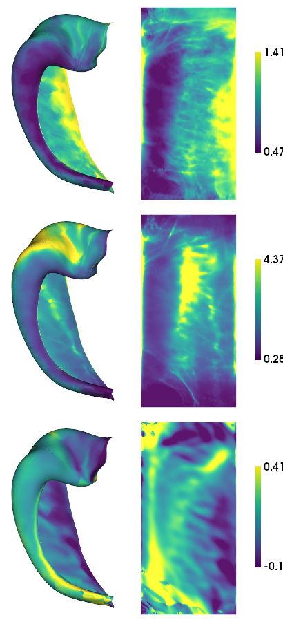

.. code:: ipython3

    import numpy as np
    import matplotlib.pyplot as plt
    import nibabel as nib
    import hippomaps as hm

.. code:: ipython3

    source_dir = '../../publication-hippomaps/sourcedata/BIDS_HISTO/'
    hippunfold_dir = '../../publication-hippomaps/hippunfold/HISTO_v1.3.0_100um/hippunfold/'
    
    subs = ['bbhist', 'bbhist', 'pli3d', '122017', '122017', '152017', '152017']
    ses = ''
    hemis = ['L','R','L','R','L','L','R','L','R']
    labels = 'hipp'
    den='unfoldiso'
    
    # get expected number of vertices and their indices
    nV,iV = hm.config.get_nVertices(labels,den) 
    
    features = ['thickness', 'gyrification', 'curvature']
    morph_dat_hist = np.zeros([nV,len(subs),len(features)])*np.nan
    d=[]
    for f,feature in enumerate(features):
        for s,sub in enumerate(subs):
            d = nib.load(f'{hippunfold_dir}/sub-{sub}/surf/sub-{sub}_hemi-{hemis[s]}_space-corobl'\
                         f'_den-{den}_label-{labels}_{feature}.shape.gii')
            morph_dat_hist[:,s,f] = d.darrays[0].data
            if feature=='curvature':
                morph_dat_hist[:,s,f] = np.tanh(morph_dat_hist[:,s,f])
                if hemis[s]=="R":
                    morph_dat_hist[:,s,f] = -morph_dat_hist[:,s,f]

.. code:: ipython3

    hm.plotting.surfplot_canonical_foldunfold(np.mean(morph_dat_hist,axis=1), labels=labels, hemis=['L'], unfoldAPrescale=True, den=den, color_bar='right', share='row', tighten_cwindow=True, embed_nb=True)

.. parsed-literal::

    /export03/data/opt/venv/lib/python3.8/site-packages/brainspace/plotting/base.py:287: UserWarning: Interactive mode requires 'panel'. Setting 'interactive=False'
      warnings.warn("Interactive mode requires 'panel'. "

.. code:: ipython3

    nV

.. parsed-literal::

    7262

.. code:: ipython3

    ## micapipe_dir = '../sourcedata/Supersession_PNI'
    hippunfold_dir = '../../publication-hippomaps/hippunfold/PNI_v1.3.0_super/hippunfold'
    
    subs = ['PNC002', 'PNC003', 'PNC006', 'PNC007', 'PNC009', 'PNC010', 'PNC015', 'PNC016', 'PNC018', 'PNC019']
    ses = ''
    hemis = ['L','R']
    labels = ['hipp']#,'dentate'] 
    den = '0p5mm'
    
    # get expected number of vertices and their indices
    nV,iV = hm.config.get_nVertices(labels,den) 
    
    morph_dat_MRI7T = np.zeros([nV,2,len(subs),len(features)])*np.nan
    d=[]
    for h,hemi in enumerate(hemis):
        for l,label in enumerate(labels):
            for f,feature in enumerate(features):
                for s,sub in enumerate(subs):
                    try:
                        d = nib.load(f'{hippunfold_dir}/sub-{sub}/surf/sub-{sub}_hemi-{hemi}_space-T1w'\
                                     f'_den-{den}_label-{label}_{feature}.shape.gii')
                        morph_dat_MRI7T[iV[l],h,s,f] = d.darrays[0].data
                    except:
                        print(f'{sub} {feature} {label} not found')
    morph_dat_MRI7T[:,0,:,2] = -morph_dat_MRI7T[:,0,:,2]

.. code:: ipython3

    hm.plotting.surfplot_canonical_foldunfold(np.nanmean(morph_dat_MRI7T,axis=(1,2)), hemis=['L'], labels=labels, unfoldAPrescale=True, den=den, color_bar='right', share='row', tighten_cwindow=True, embed_nb=True)

.. image:: Morphology_files/Morphology_5_0.png

.. code:: ipython3

    micapipe_dir = '../../publication-hippomaps/sourcedata/Micapipe_MICs'
    hippunfold_dir = '../../publication-hippomaps/hippunfold/MICs_v1.3.0/hippunfold'
    
    subs = ['HC048', 'HC043', 'HC087', 'HC037', 'HC055', 'HC100', 'HC036', 'HC017', 'HC088', 'HC040', 'HC058', 'HC076', 'HC090', 'HC059', 'HC101', 'HC063', 'HC094', 'HC024', 'HC050',
     'HC080', 'HC013', 'HC026', 'HC001', 'HC084', 'HC105', 'HC083', 'HC042', 'HC014', 'HC033', 'HC081', 'HC106', 'HC108', 'HC095', 'HC002', 'HC102', 'HC028', 'HC020', 'HC049',
     'HC007', 'HC023', 'HC065', 'HC025', 'HC056', 'HC003', 'HC015', 'HC077', 'HC067', 'HC072', 'HC109', 'HC086', 'HC089', 'HC091', 'HC031', 'HC039', 'HC112', 'HC068', 'HC034',
     'HC032', 'HC060', 'HC047', 'HC103', 'HC046', 'HC009', 'HC097', 'HC116', 'HC053', 'HC079', 'HC029', 'HC075', 'HC078', 'HC057', 'HC018', 'HC074', 'HC064',
     'HC096', 'HC010', 'HC038', 'HC093', 'HC082', 'HC092', 'HC027', 'HC019', 'HC005', 'HC008', 'HC011', 'HC044', 'HC030', 'HC035', 'HC085', 'HC069', 'HC041', 'HC012', 'HC054', 'HC022', 'HC016', 'HC099',
     'HC073', 'HC052', 'HC045']
    ses = 'ses-01'
    hemis = ['L','R']
    labels = ['hipp']#,'dentate'] 
    den = '0p5mm'
    
    # get expected number of vertices and their indices
    nV,iV = hm.config.get_nVertices(labels,den) 
    
    morph_dat_MRI3T = np.zeros([nV,2,len(subs),len(features)])*np.nan
    d=[]
    for h,hemi in enumerate(hemis):
        for l,label in enumerate(labels):
            for f,feature in enumerate(features):
                for s,sub in enumerate(subs):
                    try:
                        d = nib.load(f'{hippunfold_dir}/sub-{sub}/{ses}/surf/sub-{sub}_{ses}_hemi-{hemi}_space-T1w'\
                                     f'_den-{den}_label-{label}_{feature}.shape.gii')
                        morph_dat_MRI3T[iV[l],h,s,f] = d.darrays[0].data
                    except:
                        print(f'{sub} {feature} {label} not found')
    morph_dat_MRI3T[:,0,:,2] = -morph_dat_MRI3T[:,0,:,2]

.. code:: ipython3

    hm.plotting.surfplot_canonical_foldunfold(np.nanmean(morph_dat_MRI3T,axis=(1,2)), hemis=['L'], labels=labels, unfoldAPrescale=True, den=den, color_bar='right', share='row', tighten_cwindow=True, embed_nb=True)

.. image:: Morphology_files/Morphology_7_0.png

.. code:: ipython3

    # save 2D map
    for f,feature in enumerate(features):
        for h,hemi in enumerate(hemis):
            cdat = np.nanmean(morph_dat_MRI3T[iV[0],h,:,f],axis=1).flatten()
            data_array = nib.gifti.GiftiDataArray(data=cdat)
            image = nib.gifti.GiftiImage()
            image.add_gifti_data_array(data_array)
            nib.save(image, f'../maps/HippoMaps-initializationMaps/Dataset-MICs/MRI-3T-{feature}_average-99_hemi-{hemi}_den-0p5mm_label-hipp.shape.gii')

.. code:: ipython3

    # save 2D map
    for f,feature in enumerate(features):
        cdat = np.nanmean(morph_dat_MRI7T[iV[0],:,:,f],axis=(1,2)).flatten()
        data_array = nib.gifti.GiftiDataArray(data=cdat)
        image = nib.gifti.GiftiImage()
        image.add_gifti_data_array(data_array)
        nib.save(image, f'../maps/HippoMaps-initializationMaps/Dataset-PNI/MRI-7T-{feature}_average-20_hemi-mix_den-0p5mm_label-hipp.shape.gii')

.. code:: ipython3

    for f,feature in enumerate(features):
        cdat = np.nanmean(morph_dat_hist[:,:,f],axis=1).flatten()
        data_array = nib.gifti.GiftiDataArray(data=cdat)
        image = nib.gifti.GiftiImage()
        image.add_gifti_data_array(data_array)
        nib.save(image, f'../maps/HippoMaps-initializationMaps/Dataset-Mixed/histology-{feature}_average-7_hemi-mix_den-unfoldiso_label-hipp.shape.gii')
